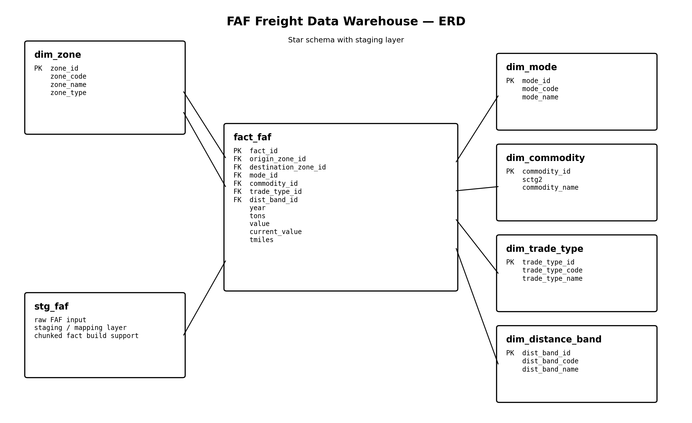

# FAF Freight Data Warehouse

A portfolio-grade freight data warehouse built on the Freight Analysis Framework (FAF) dataset.

This project transforms raw freight records into a validated, indexed, analytics-ready MySQL warehouse that supports:

- corridor analysis
- commodity concentration analysis
- mode share analysis
- trade type mix analysis
- distance-band profiling
- year-over-year freight trend analysis

It demonstrates practical strengths in:

- dimensional modeling
- SQL warehouse design
- ETL orchestration
- validation engineering
- performance tuning
- decision-ready analytics

---

## Project Goal

The goal of this project is to convert a complex freight dataset into a structured warehouse that can answer logistics and infrastructure questions such as:

- Which origin → destination corridors drive the most freight value?
- Which commodities dominate the network?
- How is value distributed across transportation modes?
- Are shipments becoming shorter-haul or longer-haul over time?
- Which zones are net exporters vs net importers?

---

## Dataset

**Source:** Freight Analysis Framework (FAF)  
**Domain:** Freight transportation / logistics / infrastructure

### Warehouse grain

One row in `fact_faf` represents a unique combination of:

- origin zone
- destination zone
- mode
- commodity
- trade type
- distance band
- year

### Measures

- `tons`
- `value`
- `current_value`
- `tmiles`

---

## Architecture Overview

The warehouse uses a **star schema**:

### Fact table
- `fact_faf`

### Dimension tables
- `dim_zone`
- `dim_mode`
- `dim_commodity`
- `dim_trade_type`
- `dim_distance_band`

### Staging table
- `stg_faf`

Schema diagram:



---

## Project Structure

```
Freight-Data-Warehouse/
├── data/
├── diagrams/
├── docs/
├── etl/
├── notebooks/
├── sql/
│   ├── analytics/
│   ├── ddl/
│   ├── perf/
│   └── validation/
├── .env.example
├── .gitignore
├── LICENSE.txt
├── README.md
├── requirements.txt
└── run_project.bat
```

## Key folders

`etl/` — Python ETL pipeline scripts

`sql/ddl/` — schema creation and support DDL

`sql/validation/` — warehouse validation checks

`sql/perf/` — performance benchmarking and index scripts

`sql/analytics/` — decision-ready analytics queries

`docs/` — setup, walkthrough, data dictionary, narratives


## ETL Pipeline

The build process follows this order:

- Build dimensions
- Load staging
- Build fact table
- Run validation
- Apply performance improvements
- Run analytics layer


## How to Run
1. Configure environment variables

Create a .env file in the repository root:

```env
DB_HOST=localhost
DB_PORT=3306
DB_USER=root
DB_PASSWORD=your_password
DB_NAME=faf_dw
```
2. Create the database

Run in MySQL:

```sql
CREATE DATABASE faf_dw;
```

3. Create schema objects

Run the required DDL scripts in `sql/ddl/`.


4. Run the pipeline

Windows:

```bash
run_project.bat
```

Or directly:

```bash
python -m etl.run_all
```

5. Run analytics queries

Open `sql/analytics/00_params.sql`, set year parameters, then execute the desired query files.


## Validation Layer

Validation checks cover:

orphan dimension keys

null critical keys

duplicate fact grain

negative measures

selected staging consistency checks

Validation runner:

```bash
python -m etl.05_validate
```


## Performance Layer

The project includes a performance layer with:

baseline queries

EXPLAIN ANALYZE before/after scripts


composite indexes for common analytical workloads

Performance notes:

`docs/performance_notes.md`


## Analytics Layer

The analytics layer includes:

top freight corridors

top commodities by value

mode mix

trade type mix

distance-band analysis

year-over-year deltas

zone inflow / outflow balance

Interpretation files:

- `docs/business_narratives.md`
- `docs/executive_queries.md`


## Documentation

- `docs/setup.md`
- `docs/data_dictionary.md`
- `docs/project_walkthrough.md`


## Future Improvements

Possible future extensions:

dashboard layer (Power BI / Tableau / Streamlit)

automated analytics export

orchestration with Airflow / Prefect

cloud warehouse migration

partitioning for large-scale performance


## Portfolio Positioning

This project demonstrates a strong intermediate applied data / analytics engineering workflow because it combines:

warehouse design

ETL engineering

data validation

performance optimization

business-facing analytics


